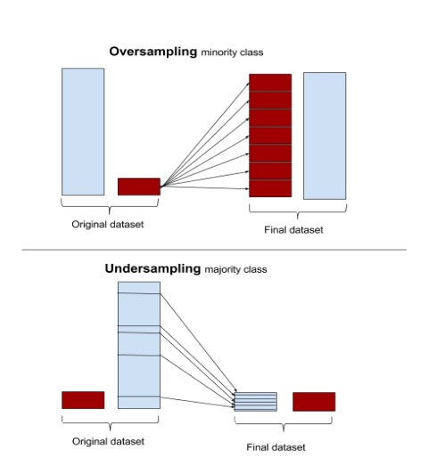
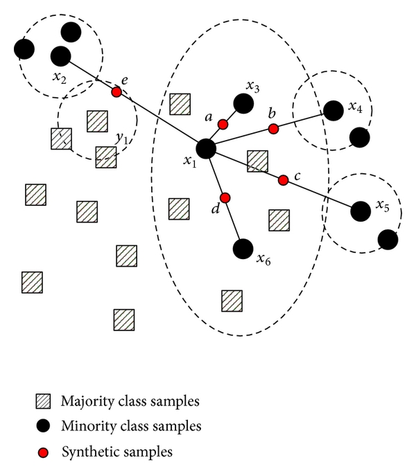

# Credit Card Fraud Detection System

>Our task is to solve the Problem given in Kaggle as [Credit Card Fraud Detection](https://www.kaggle.com/mlg-ulb/creditcardfraud)

[![Build Status][travis-image]][travis-url]

## DataSet Overview

The datasets contain credit card transactions of European cardholders over a two day collection period in September 2013.
This dataset contains 30 features which include details of time and amount of the transaction and other 28 features from V1, V2,.. to V28 are the result of PCA transformation (this is done because of confidentiality). And another feature 'Class' is an indication that transaction is fraudulent or not.

**Feature Description:**
- Time: the seconds elapsed between each transaction and the first transaction in the dataset
- Amount: the Transaction Amount
- V1, V2,..., V28: numerical input variables which are the output of PCA transformation
- Class: the response variable, it takes two values as 1 - for fraud and 0 - otherwise

>**Objective:** Here our task is to find out given transaction is it fraudulent or not? 

This is **Binary Classification Problem**. 
This dataset has 492 frauds out of 284,807 transactions means we have uneven distribution as fraud class accounts for only 0.172% of all transactions. Thus this *dataset is highly **unbalanced***.

**File:** `DataSet_creditcardfraud.zip`

## Evaluation

Due to class imbalance ratio, accuracy is measured using the Area Under the **Precision-Recall Curve(AUPRC)**.
> Confusion matrix accuracy is not meaningful for unbalanced classification.

## OverSampling

To resolve an issue of the unbalanced dataset, we use oversampling techniques.

>**From Wikipedia:** The usual reason for oversampling is to correct for a bias in the original dataset. One scenario where it is useful is when training a classifier using labeled training data from a biased source since labeled training data is valuable but often comes from un-representative sources.

There are 4 ways of addressing class imbalance problems like these:

1. Synthesis of new minority class instances
2. Over-sampling of a minority class
3. Under-sampling of the majority class
4. tweak the cost function to make misclassification of minority instances more important than misclassification of majority instances

Out of 4 methods mentioned above, here we use **SMOTE: Synthetic Minority Over-sampling Technique**.
Here is the [[link]](http://rikunert.com/SMOTE_explained) where it is explained thoroughly.

To implement SMOTE we use `imblearn` package. (Here is the [[link]](http://contrib.scikit-learn.org/imbalanced-learn/stable/generated/imblearn.over_sampling.SMOTE.html) for further detail to how to use the package)

## Approaches

### 1. Logistic Regression

**code:** [`Logistic_Regression.py`](https://github.com/kalpeshdusane/Credit-Card-Fraud-Detection/blob/master/code/Logistic_Regression.py)

### 2. SVM (Support Vector Machine)

**code:** [`SVM.py`](https://github.com/kalpeshdusane/Credit-Card-Fraud-Detection/blob/master/code/SVM.py)

### 3. Neural Network

**code:** [`NeuralNet.py`](https://github.com/kalpeshdusane/Credit-Card-Fraud-Detection/blob/master/code/NeuralNet.py)

### 4. Random Forest

**code:** [`Random_Forest.py`](https://github.com/kalpeshdusane/Credit-Card-Fraud-Detection/blob/master/code/Random_Forest.py)

## Dependencies

	python3.5
	numpy
	sklearn
	pandas
	imblearn

<!-- Markdown link & img dfn's -->
[travis-image]: https://img.shields.io/travis/dbader/node-datadog-metrics/master.svg?style=flat-square
[travis-url]: https://travis-ci.org/dbader/node-datadog-metrics
